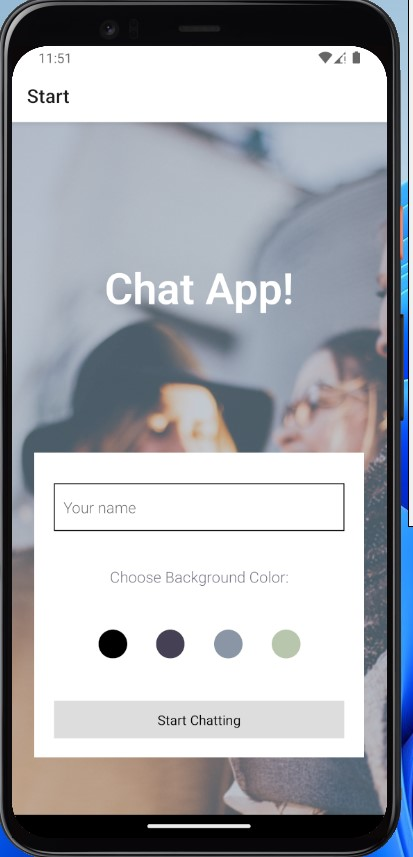

# Chat App

<p align ="center" >

</p>


## Overview

Chat App is an application for both Android /iOS created with Reactive Native and Expo.
The app provides users with a chart interface and options to take pictures, and share images and their location.
Additionally users can choose a theme color on the start screen before entering the chat.

This app has Google Cloud Firestore as a non-relational database where images and messages are being stored. This last feature allows users to read chat messages even when the app is offline.

### Built with

- JavaScript <br>
- React Native <br>
- Expo <br>
- Google Firebase <br>
- Google Firestore Database <br>

## Getting started

### Prerequisites

Install nodejs LTS version.

#### Setting up your database

- Sign in at Google Firebase
- Create a new project in test mode
- In there create a Firestore Database
- At 'Settings' -> 'General' -> 'Your apps' -> 'Firestore for Web' generate your configuration object.

### Installation

Clone the repository:

```shell
git clone https://github.com/Mcelest19/Chat-App
```

In the `App.js` file replace the `firebaseConfig` variable with the configuration info from your own Firestore database:

```js
firebase.initializeApp({
  apiKey: "your-api-key",
  authDomain: "your-authdomain",
  projectId: "your-project-id",
  storageBucket: "your-storage-bucket",
  messagingSenderId: "your-messaging-sender-id",
  appId: "your-app-id",
});
```

then run the next commands:

```shell
npx expo install
npx expo start
```

Install the Expo Go App from [Apple Store](https://apps.apple.com/us/app/expo-go/id982107779) or [Google Play Store](https://play.google.com/store/apps/details?id=host.exp.exponent&gl=DE) to test the project on your mobile device

Install [Android Studio](https://developer.android.com/studio) for Android Emulator or [Xcode](https://apps.apple.com/de/app/xcode/id497799835?mt=12) for ios Simulator to test the app